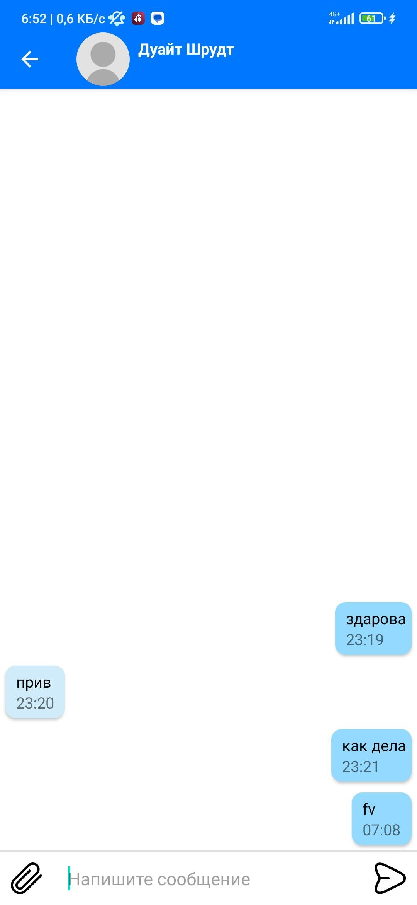

## О приложении  
интернет-сервис для медицинских работников Dr. Vrach. Областью применения программы является обмен сообщениями между врачами, а также создание публикаций.
  

   

## Используемые технологии  
<tr><td valign="top" >

- Kotlin  
  

- View  
  

- Jetpack navigation  
  

- Koin  
  

- Retrofit  
  

- Moshi 
  

- Glide  
  

- Facebook shimmer

</td>

   

## Функционал  
<tr><td valign="top" >

- регистрация;
- авторизация;
- обмен сообщениями;
- ведение профилей врачей;
- ведение публикаций;
- поиск пользователей;
- получение уведомлений.

</td>

 

## Скриншоты  
<tr><td valign="top" >

</td><td valign="top" width="50%">

  
  
  
  
  
  

</td></tr></table>

 

## Серверная часть

https://github.com/murtazin-dn/diplom-backend

